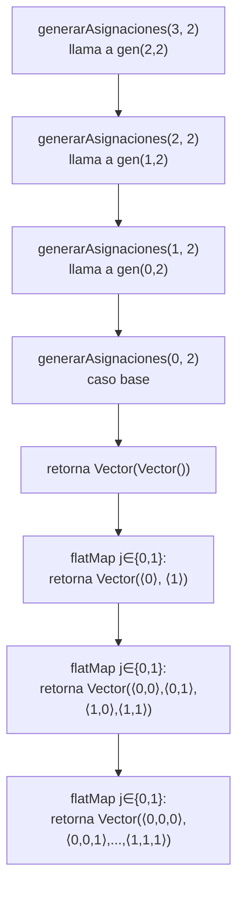

# Informe de Procesos — Asignación Óptima de Aulas


---

## Nota sobre la pila de llamados

En programación funcional, las funciones que **no son recursivas** no generan una pila de llamados propia: se evalúan en una sola invocación y devuelven su resultado directamente. Las funciones `solapan`, `choques`, `capacidadFallida`, `desperdicio`, `movilidad`, `costoAsignacion` y `asignacionOptima` pertenecen a esta categoría; todas ellas delegan el recorrido de las colecciones a **funciones de alto orden** (`map`, `flatMap`, `filter`, `count`, `sortBy`, `zip`, `sum`, `minBy`), que internamente iteran sin exponer una pila de llamados al programador.

Por contraste, `generarAsignaciones` sí es recursiva y sí genera una pila de llamados que se muestra explícitamente en su sección.

Para las funciones no recursivas, el análisis del proceso se realiza trazando la transformación que aplica cada función de alto orden sobre la colección de entrada, mostrando el estado intermedio en cada paso.

---

## 1. `solapan`

### Descripción

Determina si dos cursos se traslapan en el tiempo. La condición matemática es:

$$\text{solapan}(c_1, c_2) \iff \text{ini}(c_1) < \text{fin}(c_2) \;\land\; \text{ini}(c_2) < \text{fin}(c_1)$$

Esta función es una **expresión booleana pura**, no recursiva y sin efectos secundarios. No genera pila de llamados: se evalúa en tiempo constante $O(1)$ con una única invocación.

### Implementación

```scala
def solapan(c1: Curso, c2: Curso): Boolean =
  iniCurso(c1) < finCurso(c2) && iniCurso(c2) < finCurso(c1)
```

### Proceso de evaluación

La función recibe dos cursos, extrae sus extremos con los selectores `iniCurso` y `finCurso`, y evalúa la conjunción. No hay llamadas recursivas ni transformaciones de colecciones.

**Caso 1 — solapamiento real:**

Sean $c_1 = (\text{"M01"}, 4, 8, 25)$ y $c_2 = (\text{"M02"}, 6, 10, 30)$:

| Subexpresión | Valor |
|---|---|
| `iniCurso(c1) < finCurso(c2)` | $4 < 10$ → `true` |
| `iniCurso(c2) < finCurso(c1)` | $6 < 8$ → `true` |
| Resultado | `true && true` → **`true`** |

**Caso 2 — sin solapamiento:**

Sean $c_1 = (\text{"M01"}, 4, 8, 25)$ y $c_3 = (\text{"M03"}, 12, 16, 20)$:

| Subexpresión | Valor |
|---|---|
| `iniCurso(c1) < finCurso(c3)` | $4 < 16$ → `true` |
| `iniCurso(c3) < finCurso(c1)` | $12 < 8$ → `false` |
| Resultado | `true && false` → **`false`** |

---

## 2. `choques`

### Descripción

Cuenta el número de pares $(i, j)$ con $i < j$ tales que $\alpha_i = \alpha_j \geq 0$ y los cursos $c_i$ y $c_j$ se solapan:

$$\text{CH}^\alpha_C = \bigl|\{(i,j) \mid 0 \leq i < j < n,\; \alpha_i = \alpha_j \geq 0,\; \text{solapan}(c_i, c_j)\}\bigr|$$

La función usa `flatMap`, `filter`, `map` y `sum` — no es recursiva y no genera pila de llamados. El recorrido es $O(n^2)$ en el número de pares.

### Implementación

```scala
def choques(cursos: Cursos, a: Asignacion): Int = {
  val indices = cursos.indices.toVector
  indices.flatMap { i =>
    indices.filter(j => j > i && a(i) == a(j) && a(i) >= 0)
      .map(j => if (solapan(cursos(i), cursos(j))) 1 else 0)
  }.sum
}
```

### Proceso paso a paso

Entrada: $C = \langle c_0, c_1, c_2 \rangle$ con los cursos del Ejemplo 1, $\alpha = \langle 0, 0, 1 \rangle$.

**Paso 1 — construcción de `indices`:**

```
indices = Vector(0, 1, 2)
```

**Paso 2 — `flatMap` sobre cada $i$:**

Para cada $i$, se aplica `filter` para seleccionar los $j > i$ que comparten aula con $i$ (y cuya aula es válida), luego `map` para convertir cada par en 0 o 1.

| $i$ | Candidatos $j > i$ | Filtro $\alpha_j = \alpha_i \geq 0$ | Pares que pasan | `solapan`? | Contribución |
|---|---|---|---|---|---|
| 0 | {1, 2} | $\alpha_1=0=\alpha_0$ ✓, $\alpha_2=1\neq\alpha_0$ ✗ | {1} | `solapan`($c_0$,$c_1$) = `true` | 1 |
| 1 | {2} | $\alpha_2=1\neq\alpha_1=0$ ✗ | {} | — | 0 |
| 2 | {} | — | {} | — | 0 |

**Paso 3 — `flatMap` produce:** `Vector(1, 0, 0)` (un elemento por par que pasó el filtro)

**Paso 4 — `sum`:** $1 + 0 + 0 = 1$

$$\text{choques}(C, \langle 0,0,1\rangle) = 1$$

---

## 3. `capacidadFallida`

### Descripción

Cuenta cuántos cursos tienen un aula asignada con capacidad estrictamente menor al número de estudiantes:

$$\text{CF}^\alpha_{C,A} = \bigl|\{i \mid \alpha_i \geq 0 \;\land\; \text{cap}(A_{\alpha_i}) < \text{est}(C_i)\}\bigr|$$

Usa `count` — no es recursiva y no genera pila de llamados.

### Implementación

```scala
def capacidadFallida(cursos: Cursos, aulas: Aulas, a: Asignacion): Int =
  cursos.indices.toVector.count { i =>
    a(i) >= 0 && capAula(aulas(a(i))) < estCurso(cursos(i))
  }
```

### Proceso paso a paso

Entrada: $C_2$ y $A_2$ del Ejemplo 2 del enunciado, $\alpha = \langle 0, 1, 0, 1 \rangle$.

$A_2 = \langle (\text{"S201"}, 45), (\text{"S202"}, 30) \rangle$

**`count` evalúa el predicado para cada índice $i$:**

| $i$ | $\alpha_i$ | $\text{cap}(A_{\alpha_i})$ | $\text{est}(C_i)$ | $\text{cap} < \text{est}$? | Cuenta |
|---|---|---|---|---|---|
| 0 (F01, 40 est) | 0 | 45 | 40 | $45 < 40$ → `false` | 0 |
| 1 (F02, 25 est) | 1 | 30 | 25 | $30 < 25$ → `false` | 0 |
| 2 (F03, 50 est) | 0 | 45 | 50 | $45 < 50$ → `true` | 1 |
| 3 (F04, 15 est) | 1 | 30 | 15 | $30 < 15$ → `false` | 0 |

$$\text{capacidadFallida} = 1$$

---

## 4. `desperdicio`

### Descripción

Suma la diferencia positiva entre capacidad del aula y estudiantes del curso, para cada curso asignado con capacidad suficiente:

$$\text{DE}^\alpha_{C,A} = \sum_{\substack{i=0\\\alpha_i \geq 0}}^{n-1} \max\!\bigl(\text{cap}(A_{\alpha_i}) - \text{est}(C_i),\; 0\bigr)$$

Cuando $\text{cap} < \text{est}$, el término es 0 (ese caso se penaliza por `capacidadFallida`). Usa `map` y `sum` — no es recursiva.

### Implementación

```scala
def desperdicio(cursos: Cursos, aulas: Aulas, a: Asignacion): Int =
  cursos.indices.toVector.map { i =>
    if (a(i) >= 0) {
      val diff = capAula(aulas(a(i))) - estCurso(cursos(i))
      if (diff > 0) diff else 0
    } else 0
  }.sum
```

### Proceso paso a paso

Entrada: Ejemplo 1, $\alpha = \langle 0, 1, 0 \rangle$, $A_1 = \langle (\text{"E101"}, 30), (\text{"E102"}, 40) \rangle$.

**`map` transforma cada índice en su contribución:**

| $i$ | $\alpha_i$ | $\text{cap}$ | $\text{est}$ | $\text{diff} = \text{cap} - \text{est}$ | $\max(\text{diff}, 0)$ |
|---|---|---|---|---|---|
| 0 (M01) | 0 | 30 | 25 | 5 | **5** |
| 1 (M02) | 1 | 40 | 30 | 10 | **10** |
| 2 (M03) | 0 | 30 | 20 | 10 | **10** |

**`map` produce:** `Vector(5, 10, 10)`

**`sum`:** $5 + 10 + 10 = 25$

$$\text{desperdicio}(C_1, A_1, \langle 0,1,0\rangle) = 25$$

---

## 5. `movilidad`

### Descripción

Ordena los cursos asignados por hora de inicio y suma las distancias $D[\alpha_{\sigma_j}][\alpha_{\sigma_{j+1}}]$ entre aulas consecutivas:

$$\text{MV}^\alpha_{C,A,D} = \sum_{j=0}^{k-2} D[\alpha_{\sigma_j}][\alpha_{\sigma_{j+1}}]$$

donde $\sigma$ es la permutación que ordena los índices de cursos asignados por $\text{ini}$. Usa `filter`, `sortBy`, `zip`, `map` y `sum` — no es recursiva.

### Implementación

```scala
def movilidad(cursos: Cursos, aulas: Aulas, d: Distancias,
              a: Asignacion): Int = {
  val asignados = cursos.indices.toVector
    .filter(i => a(i) >= 0)
    .sortBy(i => iniCurso(cursos(i)))
  asignados.zip(asignados.tail)
    .map { case (i, j) => d(a(i))(a(j)) }
    .sum
}
```

### Proceso paso a paso

Entrada: Ejemplo 1, $\alpha = \langle 0, 1, 0 \rangle$, $D_1 = \begin{pmatrix}0&3\\3&0\end{pmatrix}$.

Cursos: M01 (ini=4), M02 (ini=6), M03 (ini=12).

**Paso 1 — `filter(a(i) >= 0)`:** todos están asignados → `Vector(0, 1, 2)`

**Paso 2 — `sortBy(iniCurso)`:**

| Índice | ini |
|---|---|
| 0 (M01) | 4 |
| 1 (M02) | 6 |
| 2 (M03) | 12 |

Ya ordenados → `asignados = Vector(0, 1, 2)`

**Paso 3 — `zip(tail)`:**

```
asignados       = Vector(0, 1, 2)
asignados.tail  = Vector(1, 2)
zip             = Vector((0,1), (1,2))
```

**Paso 4 — `map { case (i,j) => d(a(i))(a(j)) }`:**

| Par $(i,j)$ | $\alpha_i$ | $\alpha_j$ | $D[\alpha_i][\alpha_j]$ |
|---|---|---|---|
| (0, 1) | 0 | 1 | $D[0][1] = 3$ |
| (1, 2) | 1 | 0 | $D[1][0] = 3$ |

`map` produce: `Vector(3, 3)`

**Paso 5 — `sum`:** $3 + 3 = 6$

$$\text{movilidad} = 6$$

**Caso borde:** si `asignados` tiene 0 o 1 elementos, `asignados.tail` es vacío, `zip` produce `Vector()` y `sum` devuelve 0. Correcto por definición ($k < 2 \Rightarrow \text{MV} = 0$).

---

## 6. `costoAsignacion`

### Descripción

Combina las cuatro métricas con los pesos dados:

$$\text{CT}^\alpha_{C,A,D} = w_{CH} \cdot \text{CH}^\alpha_C + w_{CF} \cdot \text{CF}^\alpha_{C,A} + w_{DE} \cdot \text{DE}^\alpha_{C,A} + w_{MV} \cdot \text{MV}^\alpha_{C,A,D}$$

No es recursiva. Es una expresión aritmética que delega en las cuatro funciones anteriores y combina sus resultados. No genera pila de llamados propia.

### Implementación

```scala
def costoAsignacion(cursos: Cursos, aulas: Aulas, d: Distancias,
                    a: Asignacion, w: Pesos): Int =
  w._1 * choques(cursos, a) +
  w._2 * capacidadFallida(cursos, aulas, a) +
  w._3 * desperdicio(cursos, aulas, a) +
  w._4 * movilidad(cursos, aulas, d, a)
```

### Proceso de evaluación

Entrada: Ejemplo 1, $\alpha = \langle 0, 1, 0 \rangle$, $w = (1000, 100, 1, 2)$.

Cada subexpresión se evalúa independientemente (resultados calculados en las secciones anteriores):

| Componente | Función | Resultado | $w \times$ resultado |
|---|---|---|---|
| Choques | `choques` | 0 | $1000 \times 0 = 0$ |
| Capacidad fallida | `capacidadFallida` | 0 | $100 \times 0 = 0$ |
| Desperdicio | `desperdicio` | 25 | $1 \times 25 = 25$ |
| Movilidad | `movilidad` | 6 | $2 \times 6 = 12$ |

$$\text{CT} = 0 + 0 + 25 + 12 = 37$$

---

## 7. `generarAsignaciones`

### Descripción

Genera todas las asignaciones completas $\alpha \in \{0, \ldots, m-1\}^n$. Es la **única función recursiva** del módulo secuencial.

**Caso base:** $n = 0 \Rightarrow$ devuelve `Vector(Vector.empty)` (la única asignación vacía).

**Caso recursivo:** $n > 0 \Rightarrow$ genera recursivamente las $m^{n-1}$ asignaciones para $n-1$ cursos y luego extiende cada una con cada valor $j \in \{0,\ldots,m-1\}$, produciendo $m^n$ asignaciones de longitud $n$.

$$\text{gen}(0, m) = \{\langle\rangle\} \qquad \text{gen}(n, m) = \{a \mathbin{+\!\!+} \langle j\rangle \mid a \in \text{gen}(n-1, m),\; j \in \{0,\ldots,m-1\}\}$$

### Implementación

```scala
def generarAsignaciones(n: Int, m: Int): Vector[Asignacion] = {
  if (n == 0) Vector(Vector.empty)
  else generarAsignaciones(n - 1, m)
    .flatMap(a => (0 until m).toVector.map(j => a :+ j))
}
```

### Pila de llamados — ejemplo con $n = 3$, $m = 2$

La función genera una cadena de llamadas recursivas hasta alcanzar el caso base ($n=0$), luego desapila construyendo el resultado en cada retorno.



**Estado de la pila durante la bajada (antes del caso base):**

```
[ generarAsignaciones(3,2) ]   ← tope (esperando resultado de gen(2,2))
[ generarAsignaciones(2,2) ]   ← esperando resultado de gen(1,2)
[ generarAsignaciones(1,2) ]   ← esperando resultado de gen(0,2)
[ generarAsignaciones(0,2) ]   ← CASO BASE, retorna Vector(Vector())
```

**Desapilado y construcción del resultado:**

| Nivel | Recibe de abajo | `flatMap` con $j \in \{0,1\}$ | Devuelve hacia arriba |
|---|---|---|---|
| `gen(0,2)` | — (caso base) | — | `Vector(⟨⟩)` |
| `gen(1,2)` | `Vector(⟨⟩)` | `⟨⟩ :+ 0`, `⟨⟩ :+ 1` | `Vector(⟨0⟩, ⟨1⟩)` |
| `gen(2,2)` | `Vector(⟨0⟩,⟨1⟩)` | cada $a$ extendido con 0 y 1 | `Vector(⟨0,0⟩,⟨0,1⟩,⟨1,0⟩,⟨1,1⟩)` |
| `gen(3,2)` | `Vector(4\ asignaciones)` | cada $a$ extendido con 0 y 1 | `Vector(⟨0,0,0⟩,⟨0,0,1⟩,⟨0,1,0⟩,⟨0,1,1⟩,⟨1,0,0⟩,⟨1,0,1⟩,⟨1,1,0⟩,⟨1,1,1⟩)` |

Tamaño final: $m^n = 2^3 = 8$ asignaciones. ✓

---

## 8. `asignacionOptima`

### Descripción

Explora exhaustivamente todas las asignaciones generadas por `generarAsignaciones` y devuelve la de menor costo total. No es recursiva; usa `map` y `minBy`.

### Implementación

```scala
def asignacionOptima(cursos: Cursos, aulas: Aulas, d: Distancias,
                     w: Pesos): (Asignacion, Int) =
  generarAsignaciones(cursos.length, aulas.length)
    .map(a => (a, costoAsignacion(cursos, aulas, d, a, w)))
    .minBy(_._2)
```

### Proceso paso a paso

Entrada: Ejemplo 1, $n=3$, $m=2$, $w=(1000,100,1,2)$.

**Paso 1 — `generarAsignaciones(3, 2)`** produce las 8 asignaciones (ver sección anterior).

**Paso 2 — `map(a => (a, costoAsignacion(...)))`** evalúa el costo de cada candidata:

| $\alpha$ | CH | CF | DE | MV | CT |
|---|---|---|---|---|---|
| $\langle 0,0,0\rangle$ | 1 | 0 | 15 | 0 | 1015 |
| $\langle 0,0,1\rangle$ | 1 | 0 | 25 | 3 | 1031 |
| $\langle 0,1,0\rangle$ | 0 | 0 | 25 | 6 | **37** |
| $\langle 0,1,1\rangle$ | 0 | 0 | 35 | 9 | 53 |
| $\langle 1,0,0\rangle$ | 0 | 0 | 35 | 9 | 53 |
| $\langle 1,0,1\rangle$ | 0 | 0 | 25 | 6 | 37 |
| $\langle 1,1,0\rangle$ | 1 | 0 | 25 | 3 | 1031 |
| $\langle 1,1,1\rangle$ | 1 | 0 | 15 | 0 | 1015 |

**Paso 3 — `minBy(_._2)`** selecciona el par con menor CT.

El mínimo es $\text{CT} = 37$, alcanzado por $\langle 0,1,0\rangle$ (y simétricamente por $\langle 1,0,1\rangle$). `minBy` devuelve el primero encontrado:

$$\text{asignacionOptima} = \bigl(\langle 0,1,0\rangle,\; 37\bigr)$$

Esto coincide con el resultado esperado del Ejemplo 1 del enunciado. ✓
