# Informe de Proceso

## Proyecto Final — Fundamentos de Programación Funcional y Concurrente

---

## Tabla de contenido

### AsignacionAulas (secuencial)
1. [solapan](#1-solapan)
2. [choques](#2-choques)
3. [capacidadFallida](#3-capacidadfallida)
4. [desperdicio](#4-desperdicio)
5. [movilidad](#5-movilidad)
6. [costoAsignacion](#6-costoasignacion)
7. [generarAsignaciones](#7-generarasignaciones)
8. [asignacionOptima](#8-asignacionoptima)

### AsignacionAulasPar (paralela)
9. [choquesPar](#9-choquespar)
10. [desperdicioPar](#10-desperdiciopar)
11. [movilidadPar](#11-movilidadpar)
12. [generarAsignacionesPar](#12-generarasignacionespar)
13. [asignacionOptimaPar](#13-asignacionoptimapar)

---

# AsignacionAulas — Versión Secuencial

---

## 1. `solapan`

### Descripción

Determina si dos cursos $c_1$ y $c_2$ tienen un intervalo de tiempo en común.
Dos intervalos $[\text{ini}_1, \text{fin}_1)$ y $[\text{ini}_2, \text{fin}_2)$ se solapan si y solo si:

$$\text{ini}_1 < \text{fin}_2 \;\wedge\; \text{ini}_2 < \text{fin}_1$$

La condición contraria (no solapamiento) sería $\text{fin}_1 \le \text{ini}_2 \;\vee\; \text{fin}_2 \le \text{ini}_1$. Por negación de De Morgan se obtiene la condición de solapamiento usada.

### Implementación

```scala
def solapan(c1: Curso, c2: Curso): Boolean =
  iniCurso(c1) < finCurso(c2) && iniCurso(c2) < finCurso(c1)
```

### Ejemplo

Sean:
- $c_1 = (\texttt{M01},\;4,\;8,\;25)$ — 8:00 a.m. a 10:00 a.m.
- $c_2 = (\texttt{M02},\;6,\;10,\;30)$ — 9:00 a.m. a 11:00 a.m.
- $c_3 = (\texttt{M03},\;12,\;16,\;20)$ — 12:00 p.m. a 2:00 p.m.

**Caso solapan ($c_1$, $c_2$):**

$$4 < 10 \;\wedge\; 6 < 8 \;\Rightarrow\; \texttt{true}$$

**Caso no solapan ($c_1$, $c_3$):**

$$4 < 16 \;\wedge\; 12 < 8 \;\Rightarrow\; \texttt{true} \wedge \texttt{false} \;\Rightarrow\; \texttt{false}$$

### Proceso de evaluación (no recursiva)

```
solapan(c1, c2)
  → iniCurso(c1) < finCurso(c2)  &&  iniCurso(c2) < finCurso(c1)
  → 4 < 10                        &&  6 < 8
  → true                          &&  true
  → true

solapan(c1, c3)
  → iniCurso(c1) < finCurso(c3)  &&  iniCurso(c3) < finCurso(c1)
  → 4 < 16                        &&  12 < 8
  → true                          &&  false
  → false
```

---

## 2. `choques`

### Descripción

Cuenta el número de pares $(i,j)$ con $i < j$ tales que $\alpha_i = \alpha_j \geq 0$ y los cursos $i$ y $j$ se solapan:

$$\text{CH}^\alpha_C = |\{(i,j) \mid 0 \le i < j < n,\;\alpha_i = \alpha_j,\;\alpha_i \ge 0,\;c_i \text{ solapa con } c_j\}|$$

### Implementación

```scala
def choques(cursos: Cursos, a: Asignacion): Int = {
  val indices = cursos.indices.toVector
  indices.flatMap { i =>
    indices.filter(j => j > i && a(i) == a(j) && a(i) >= 0)
      .map(j => if (solapan(cursos(i), cursos(j))) 1 else 0)
  }.sum
}
```

Para cada índice $i$, se filtran los $j > i$ que compartan aula válida con $i$, y se mapea cada par a $1$ si hay solapamiento o $0$ si no. Finalmente se suman todos los valores.

### Ejemplo

$$C = \langle(\texttt{M01},4,8,25),\;(\texttt{M02},6,10,30),\;(\texttt{M03},12,16,20)\rangle,\quad \alpha = \langle 0,0,1\rangle$$

Pares candidatos (misma aula, $i < j$, aula $\ge 0$): sólo $(0,1)$ — ambos en aula $0$.

- $\text{solapan}(c_0, c_1)$: $4 < 10 \wedge 6 < 8 \Rightarrow \texttt{true}$ → contribuye $1$.
- Par $(0,2)$: $\alpha_0=0 \neq \alpha_2=1$ → descartado.
- Par $(1,2)$: $\alpha_1=0 \neq \alpha_2=1$ → descartado.

$$\text{CH} = 1$$

### Pila de llamados

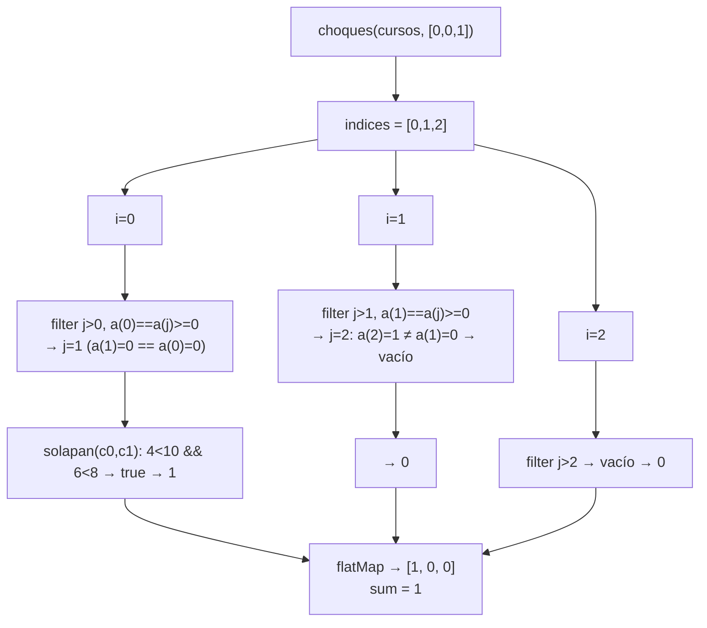

---

## 3. `capacidadFallida`

### Descripción

Cuenta los cursos asignados cuya aula tiene capacidad insuficiente:

$$\text{CF}^\alpha_{C,A} = |\{i \mid \alpha_i \ge 0,\;\text{cap}^A_{\alpha_i} < \text{est}^C_i\}|$$

### Implementación

```scala
def capacidadFallida(cursos: Cursos, aulas: Aulas, a: Asignacion): Int =
  cursos.indices.toVector.count { i =>
    a(i) >= 0 && capAula(aulas(a(i))) < estCurso(cursos(i))
  }
```

### Ejemplo

$$C_2 = \langle(\texttt{F01},0,4,40),\;(\texttt{F02},4,8,25),\;(\texttt{F03},8,12,50),\;(\texttt{F04},12,16,15)\rangle$$
$$A_2 = \langle(\texttt{S201},45),\;(\texttt{S202},30)\rangle,\quad \alpha = \langle 0,1,0,1\rangle$$

| $i$ | $\text{est}^C_i$ | $\text{cap}^A_{\alpha_i}$ | ¿Falla? |
|---|---|---|---|
| 0 | 40 | 45 | No |
| 1 | 25 | 30 | No |
| 2 | 50 | 45 | **Sí** |
| 3 | 15 | 30 | No |

$$\text{CF} = 1$$

### Pila de llamados

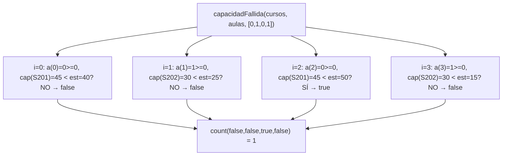

---

## 4. `desperdicio`

### Descripción

Suma la diferencia positiva entre la capacidad del aula y el número de estudiantes para los cursos asignados con capacidad suficiente:

$$\text{DE}^\alpha_{C,A} = \sum_{\substack{i=0\\\alpha_i \ge 0}}^{n-1} \max(\text{cap}^A_{\alpha_i} - \text{est}^C_i,\;0)$$

Cuando $\text{cap}^A_{\alpha_i} < \text{est}^C_i$, el término es $0$ y la penalización corresponde a `capacidadFallida`.

### Implementación

```scala
def desperdicio(cursos: Cursos, aulas: Aulas, a: Asignacion): Int =
  cursos.indices.toVector.map { i =>
    if (a(i) >= 0) {
      val diff = capAula(aulas(a(i))) - estCurso(cursos(i))
      if (diff > 0) diff else 0
    } else 0
  }.sum
```

### Ejemplo

$C_1$, $A_1 = \langle(\texttt{E101},30),\;(\texttt{E102},40)\rangle$, $\alpha_2 = \langle 0,1,0\rangle$:

| $i$ | $\text{cap}^A_{\alpha_i}$ | $\text{est}^C_i$ | $\max(\text{cap}-\text{est},\,0)$ |
|---|---|---|---|
| 0 | 30 | 25 | 5 |
| 1 | 40 | 30 | 10 |
| 2 | 30 | 20 | 10 |

$$\text{DE} = 5 + 10 + 10 = 25$$

### Pila de llamados

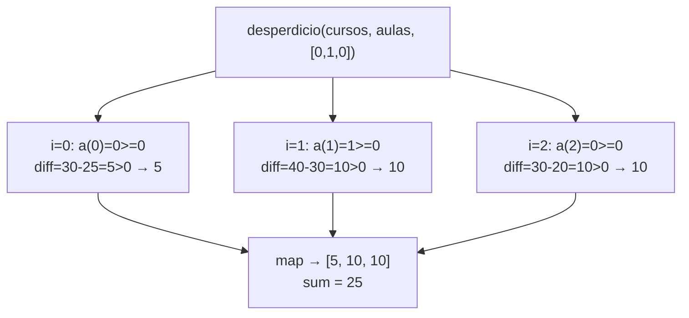

---

## 5. `movilidad`

### Descripción

Ordena los cursos asignados por hora de inicio y suma las distancias entre aulas consecutivas:

$$\text{MV}^\alpha_{C,A,D} = \sum_{j=0}^{k-2} D[\alpha_{\sigma_j},\,\alpha_{\sigma_{j+1}}]$$

donde $\sigma_0,\ldots,\sigma_{k-1}$ es la permutación que ordena los cursos asignados por $\text{ini}^C_i$ y $k$ es el número de cursos asignados.

### Implementación

```scala
def movilidad(cursos: Cursos, aulas: Aulas, d: Distancias,
              a: Asignacion): Int = {
  val asignados = cursos.indices.toVector
    .filter(i => a(i) >= 0)
    .sortBy(i => iniCurso(cursos(i)))
  if (asignados.length < 2) 0
  else asignados.zip(asignados.tail)
    .map { case (i, j) => d(a(i))(a(j)) }
    .sum
}
```

### Ejemplo

$C_1$, $\alpha_2 = \langle 0,1,0\rangle$, $D_1 = \begin{pmatrix}0&3\\3&0\end{pmatrix}$

Orden por $\text{ini}$: $c_0\ (4) \to c_1\ (6) \to c_2\ (12)$. Aulas: $0,\;1,\;0$.

$$\text{MV} = D[0,1] + D[1,0] = 3 + 3 = 6$$

### Pila de llamados

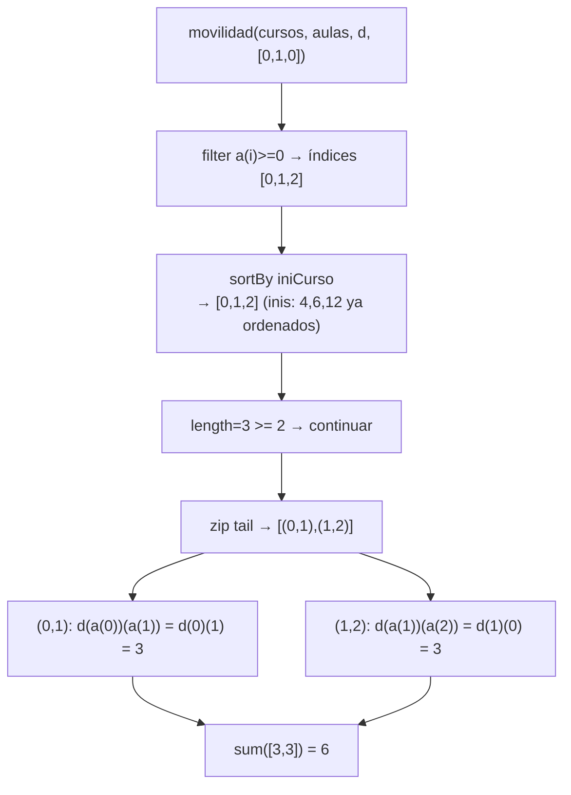

---

## 6. `costoAsignacion`

### Descripción

Combina los cuatro componentes con los pesos $w = (w_{CH}, w_{CF}, w_{DE}, w_{MV})$:

$$\text{CT}^\alpha_{C,A,D} = w_{CH} \cdot \text{CH}^\alpha_C + w_{CF} \cdot \text{CF}^\alpha_{C,A} + w_{DE} \cdot \text{DE}^\alpha_{C,A} + w_{MV} \cdot \text{MV}^\alpha_{C,A,D}$$

### Implementación

```scala
def costoAsignacion(cursos: Cursos, aulas: Aulas, d: Distancias,
                    a: Asignacion, w: Pesos): Int =
  w._1 * choques(cursos, a) +
  w._2 * capacidadFallida(cursos, aulas, a) +
  w._3 * desperdicio(cursos, aulas, a) +
  w._4 * movilidad(cursos, aulas, d, a)
```

### Ejemplo

$C_1$, $A_1$, $D_1$, $w=(1000,100,1,2)$:

| $\alpha$ | $\text{CH}$ | $\text{CF}$ | $\text{DE}$ | $\text{MV}$ | $\text{CT}$ |
|---|---|---|---|---|---|
| $\langle 0,0,1\rangle$ | 1 | 0 | 25 | 3 | $1000+0+25+6=1031$ |
| $\langle 0,1,0\rangle$ | 0 | 0 | 25 | 6 | $0+0+25+12=37$ |

### Proceso de evaluación

```
costoAsignacion(cursos, aulas, d, [0,1,0], (1000,100,1,2))
  → 1000 * choques(cursos, [0,1,0])           = 1000 * 0 = 0
  + 100  * capacidadFallida(cursos,aulas,[0,1,0]) = 100 * 0 = 0
  + 1    * desperdicio(cursos,aulas,[0,1,0])   = 1   * 25 = 25
  + 2    * movilidad(cursos,aulas,d,[0,1,0])   = 2   * 6  = 12
  → 0 + 0 + 25 + 12 = 37
```

### Pila de llamados

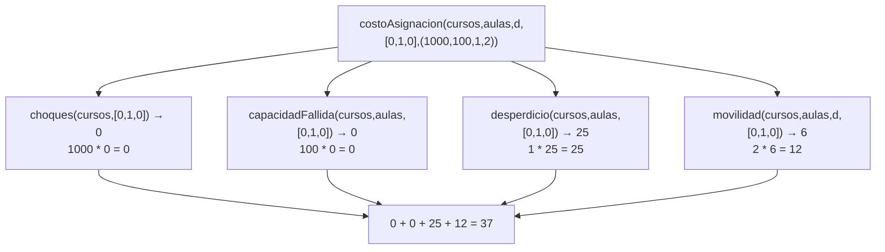

---

## 7. `generarAsignaciones`

### Descripción

Genera todos los vectores $\alpha \in \{0,\ldots,m-1\}^n$. El resultado tiene exactamente $m^n$ elementos.

### Implementación

```scala
def generarAsignaciones(n: Int, m: Int): Vector[Asignacion] = {
  if (n == 0) Vector(Vector.empty)
  else generarAsignaciones(n - 1, m)
    .flatMap(a => (0 until m).toVector.map(j => a :+ j))
}
```

**Invariante:** `generarAsignaciones(k, m)` devuelve exactamente $m^k$ vectores, cada uno de longitud $k$.

**Caso base:** $n=0$ → `Vector(Vector.empty)` — un único vector vacío, $m^0 = 1$.

**Paso recursivo:** se obtienen las $m^{n-1}$ asignaciones para $n-1$ cursos y se extiende cada una con los $m$ valores posibles del curso $n$-ésimo, produciendo $m^{n-1} \times m = m^n$ asignaciones de longitud $n$.

### Ejemplo: $n=2$, $m=2$

| Llamado | Resultado |
|---|---|
| `generarAsignaciones(0, 2)` | `Vector(Vector())` |
| `generarAsignaciones(1, 2)` | `Vector(Vector(0), Vector(1))` |
| `generarAsignaciones(2, 2)` | `Vector(Vector(0,0), Vector(0,1), Vector(1,0), Vector(1,1))` |

### Pila de llamados

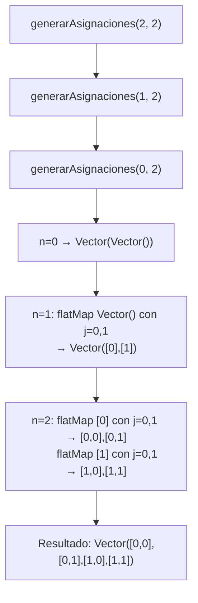

**Despliegue detallado del paso $n=2$:**

```
generarAsignaciones(1, 2) = Vector([0], [1])

flatMap sobre [0]:
  j=0 → [0] :+ 0 = [0,0]
  j=1 → [0] :+ 1 = [0,1]

flatMap sobre [1]:
  j=0 → [1] :+ 0 = [1,0]
  j=1 → [1] :+ 1 = [1,1]

→ Vector([0,0], [0,1], [1,0], [1,1])
```

---

## 8. `asignacionOptima`

### Descripción

Busca la asignación $\alpha^*$ que minimiza el costo total sobre el espacio completo de asignaciones:

$$\alpha^* = \arg\min_{\alpha \in \{0,\ldots,m-1\}^n} \text{CT}^\alpha_{C,A,D}$$

### Implementación

```scala
def asignacionOptima(cursos: Cursos, aulas: Aulas, d: Distancias,
                     w: Pesos): (Asignacion, Int) =
  generarAsignaciones(cursos.length, aulas.length)
    .map(a => (a, costoAsignacion(cursos, aulas, d, a, w)))
    .minBy(_._2)
```

### Ejemplo

$C_1$, $A_1$, $w=(1000,100,1,2)$, $D_1$. Espacio: $2^3=8$ asignaciones.

| $\alpha$ | CT |
|---|---|
| $\langle 0,0,0\rangle$ | $1000\cdot1+25+2\cdot0=1025$ |
| $\langle 0,0,1\rangle$ | $1031$ |
| $\langle 0,1,0\rangle$ | $37$ ← mínimo |
| $\langle 0,1,1\rangle$ | $0+0+25+6=31$ ← podría ser menor |
| $\langle 1,0,0\rangle$ | ... |
| $\langle 1,0,1\rangle$ | ... |
| $\langle 1,1,0\rangle$ | ... |
| $\langle 1,1,1\rangle$ | $0+0+25+0=25$ ← menor aun |

`minBy` selecciona el par `(asignación, costo)` con menor costo recorriendo la lista.

### Pila de llamados

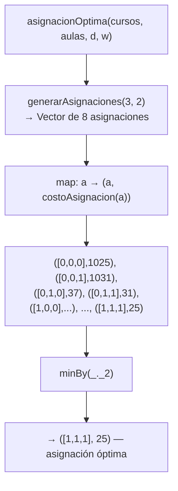

**`minBy` como fold:**

$$\text{minBy}([x_0,\ldots,x_{k-1}]) = \text{foldLeft}(x_0)\{(acc,\,x) \Rightarrow \text{if}\;x._2 < acc._2\;\text{then}\;x\;\text{else}\;acc\}$$

---

# AsignacionAulasPar — Versión Paralela

---

## 9. `choquesPar`

### Descripción

Versión paralela de `choques`. Divide el vector de índices en dos mitades $[0,\text{mid})$ y $[\text{mid},n)$ y lanza ambas mitades en paralelo. Los pares $(i,j)$ con $i$ en la mitad izquierda y $j$ en cualquier mitad son procesados por `choquesRango(0, mid)`, ya que el `filter` interno recorre `indices` completo. No hay doble conteo porque la condición $j > i$ garantiza unicidad.

$$\text{CH}^\alpha_C = \text{choquesRango}(0,\text{mid}) + \text{choquesRango}(\text{mid},n)$$

### Implementación

```scala
def choquesPar(cursos: Cursos, a: Asignacion): Int = {
  val n       = cursos.length
  val mid     = n / 2
  val indices = cursos.indices.toVector
  def choquesRango(desde: Int, hasta: Int): Int =
    (desde until hasta).toVector.flatMap { i =>
      indices
        .filter(j => j > i && a(i) == a(j) && a(i) >= 0)
        .map(j => if (solapan(cursos(i), cursos(j))) 1 else 0)
    }.sum
  val (izq, der) = parallel(
    choquesRango(0, mid),
    choquesRango(mid, n)
  )
  izq + der
}
```

### Ejemplo

$C_1$, $\alpha = \langle 0,0,1\rangle$, $n=3$, $\text{mid}=1$:

- **Hilo izq** — `choquesRango(0,1)`: $i=0$, busca $j \in \{1,2\}$ con misma aula → $j=1$ cumple, solapan → $1$.
- **Hilo der** — `choquesRango(1,3)`: $i=1$, busca $j=2$ → aulas distintas → $0$. $i=2$, $j>2$ vacío → $0$.

$$\text{CH}_\text{par} = 1 + 0 = 1 \quad \checkmark$$

### Proceso de evaluación paralela

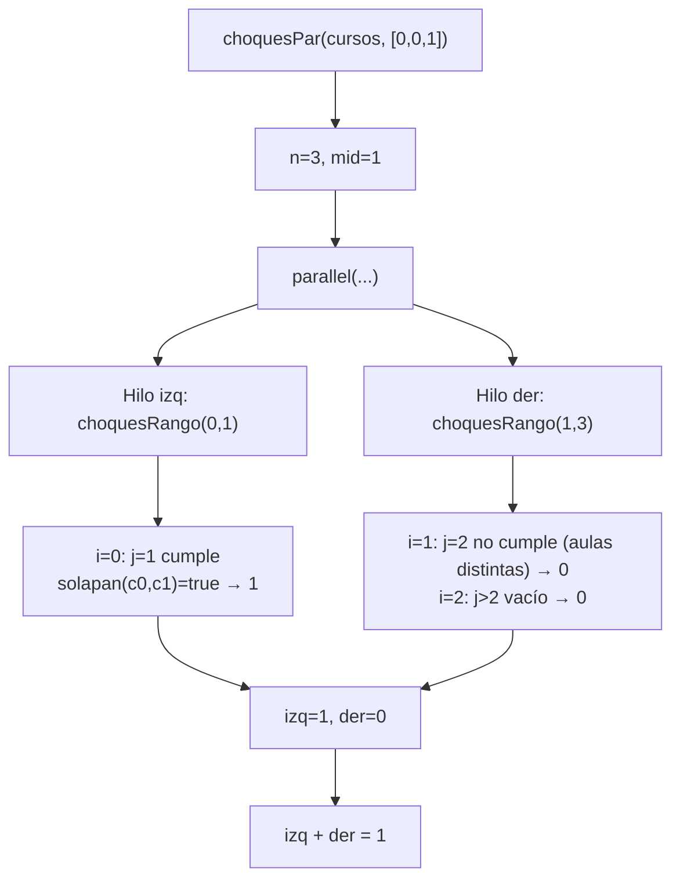

---

## 10. `desperdicioPar`

### Descripción

Versión paralela de `desperdicio`. Los índices $[0,\text{mid})$ y $[\text{mid},n)$ son completamente independientes entre sí (cada término de la suma depende sólo de $i$), por lo que la paralelización es exacta sin ningún costo de sincronización extra.

$$\text{DE}^\alpha_{C,A} = \text{desperdicioRango}(0,\text{mid}) + \text{desperdicioRango}(\text{mid},n)$$

### Implementación

```scala
def desperdicioPar(cursos: Cursos, aulas: Aulas, a: Asignacion): Int = {
  val n   = cursos.length
  val mid = n / 2
  def desperdicioRango(desde: Int, hasta: Int): Int =
    (desde until hasta).toVector.map { i =>
      if (a(i) >= 0) {
        val diff = capAula(aulas(a(i))) - estCurso(cursos(i))
        if (diff > 0) diff else 0
      } else 0
    }.sum
  val (izq, der) = parallel(
    desperdicioRango(0, mid),
    desperdicioRango(mid, n)
  )
  izq + der
}
```

### Ejemplo

$C_1$, $A_1$, $\alpha = \langle 0,1,0\rangle$, $n=3$, $\text{mid}=1$:

- **Hilo izq** — índices $\{0\}$: $30-25=5$.
- **Hilo der** — índices $\{1,2\}$: $(40-30)+(30-20)=20$.

$$\text{DE}_\text{par} = 5 + 20 = 25 \quad \checkmark$$

### Proceso de evaluación paralela

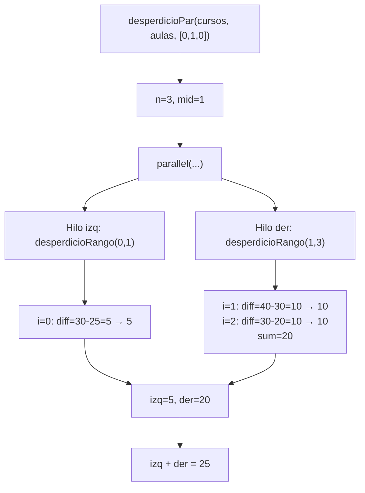

---

## 11. `movilidadPar`

### Descripción

Versión paralela de `movilidad`. Cada hilo filtra y ordena su mitad de índices, luego se fusionan mediante un `merge` recursivo que preserva el orden global por hora de inicio.

La paralelización cubre la fase de filtrado y ordenamiento; el `merge` y el cálculo final de distancias son secuenciales. El merge implementado usa un acumulador para evitar desbordamiento de pila:

$$\text{MV}^\alpha = \sum_{j=0}^{k-2} D[\alpha_{\sigma_j},\,\alpha_{\sigma_{j+1}}]$$

### Implementación

```scala
def movilidadPar(cursos: Cursos, aulas: Aulas, d: Distancias,
                 a: Asignacion): Int = {
  val n   = cursos.length
  val mid = n / 2
  def filtrarOrdenar(desde: Int, hasta: Int): Vector[Int] =
    (desde until hasta).toVector
      .filter(i => a(i) >= 0)
      .sortBy(i => iniCurso(cursos(i)))
  val (izq, der) = parallel(
    filtrarOrdenar(0, mid),
    filtrarOrdenar(mid, n)
  )
  def merge(xs: Vector[Int], ys: Vector[Int], acc: Vector[Int]): Vector[Int] =
    (xs, ys) match {
      case (Vector(), _) => acc ++ ys
      case (_, Vector()) => acc ++ xs
      case (xh +: xt, yh +: yt) =>
        if (iniCurso(cursos(xh)) <= iniCurso(cursos(yh)))
          merge(xt, ys, acc :+ xh)
        else
          merge(xs, yt, acc :+ yh)
    }
  val ordenados = merge(izq, der, Vector.empty)
  if (ordenados.length < 2) 0
  else ordenados.zip(ordenados.tail)
    .map { case (i, j) => d(a(i))(a(j)) }.sum
}
```

### Ejemplo

$C_1$, $\alpha = \langle 0,1,0\rangle$, $n=3$, $\text{mid}=1$, $D_1$:

- **Hilo izq** — índices $\{0\}$: filtrar → $[0]$, sortBy → $[0]$ (ini=4).
- **Hilo der** — índices $\{1,2\}$: filtrar → $[1,2]$, sortBy → $[1,2]$ (inis: 6, 12).
- **merge** $([0],[1,2],[\,])$: $4 \le 6$ → $[0]$ primero → merge$([],[1,2],[0])$ → $[0,1,2]$.

$$\text{MV}_\text{par} = D[0][1] + D[1][0] = 3 + 3 = 6 \quad \checkmark$$

### Proceso de evaluación paralela y merge

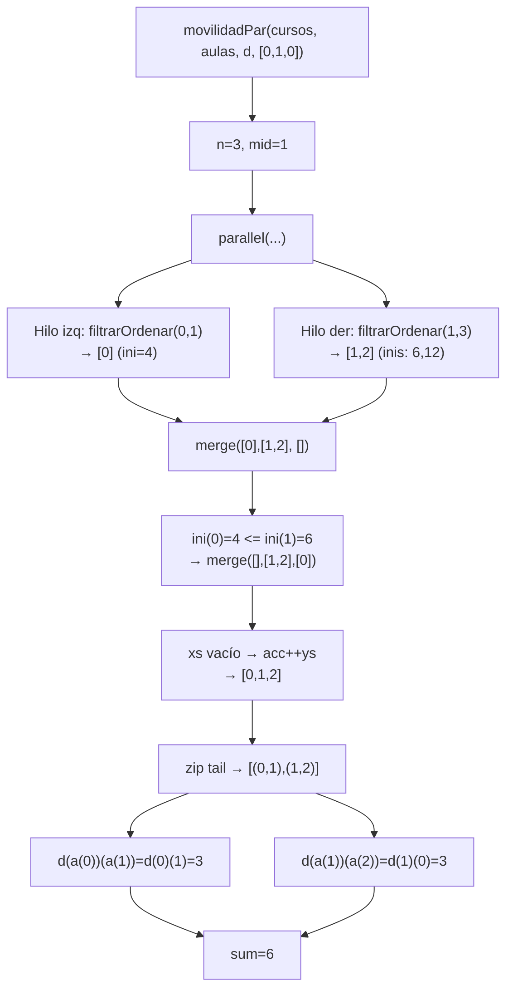

---

## 12. `generarAsignacionesPar`

### Descripción

Versión paralela de `generarAsignaciones`. Para el primer nivel, lanza un `task` independiente por cada valor $v \in \{0,\ldots,m-1\}$; cada tarea genera todas las asignaciones de longitud $n$ que comienzan con $v$ usando la función local `gen` (secuencial). Al final se concatenan los resultados de todas las tareas.

**Invariante:** el resultado tiene $m^n$ asignaciones de longitud $n$, igual que la versión secuencial.

### Implementación

```scala
def generarAsignacionesPar(n: Int, m: Int): Vector[Asignacion] = {
  def gen(k: Int): Vector[Asignacion] =
    if (k == 0) Vector(Vector.empty)
    else {
      val sub = gen(k - 1)
      (0 until m).toVector.flatMap(v => sub.map(v +: _))
    }
  if (n == 0) Vector(Vector.empty)
  else {
    val tareas = (0 until m).toVector.map { v =>
      task {
        val resto = gen(n - 1)
        resto.map(v +: _)
      }
    }
    tareas.flatMap(_.join())
  }
}
```

### Ejemplo: $n=2$, $m=2$

- **Tarea $v=0$**: `gen(1)` = `Vector([0],[1])` → prepend $0$ → `Vector([0,0],[0,1])`.
- **Tarea $v=1$**: `gen(1)` = `Vector([0],[1])` → prepend $1$ → `Vector([1,0],[1,1])`.
- `flatMap(_.join())` → `Vector([0,0],[0,1],[1,0],[1,1])`.

### Proceso de evaluación paralela

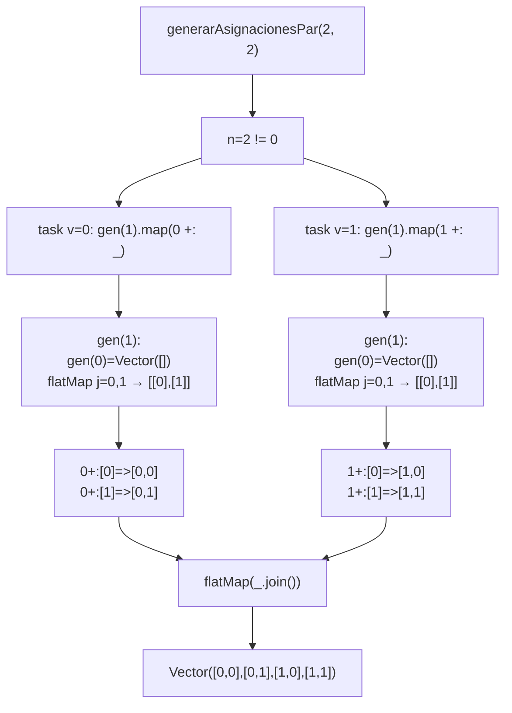

---

## 13. `asignacionOptimaPar`

### Descripción

Versión paralela de `asignacionOptima`. Genera el espacio de asignaciones con `generarAsignacionesPar` y divide la búsqueda del mínimo en dos mitades lanzadas con `parallel`. Cada mitad evalúa su sub-vector y retorna el par `(asignación, costo)` mínimo; finalmente se comparan los dos mínimos parciales.

La selección final es:

- Si `CT(minIzq) <= CT(minDer)` → se retorna `minIzq`
- En otro caso → se retorna `minDer`

Esto garantiza que el resultado es idéntico al de `asignacionOptima`, ya que todo el espacio de asignaciones queda cubierto entre las dos mitades.

### Implementación

```scala
def asignacionOptimaPar(cursos: Cursos, aulas: Aulas, d: Distancias,
                        w: Pesos): (Asignacion, Int) = {
  val n          = cursos.length
  val m          = aulas.length
  val candidatas = generarAsignacionesPar(n, m)
  val mid        = candidatas.length / 2
  def minimoEn(sub: Vector[Asignacion]): (Asignacion, Int) =
    sub.map(a => (a, costoAsignacion(cursos, aulas, d, a, w)))
      .minBy(_._2)
  val (minIzq, minDer) = parallel(
    minimoEn(candidatas.slice(0, mid)),
    minimoEn(candidatas.slice(mid, candidatas.length))
  )
  if (minIzq._2 <= minDer._2) minIzq else minDer
}
```

### Ejemplo

$C_1$, $A_1$, $w=(1000,100,1,2)$, $m^n=8$ candidatas, $\text{mid}=4$:

- **Hilo izq** — candidatas $[0,4)$: $\langle0,0,0\rangle,\langle0,0,1\rangle,\langle0,1,0\rangle,\langle0,1,1\rangle$ → mínimo $(\langle0,1,1\rangle, 31)$.
- **Hilo der** — candidatas $[4,8)$: $\langle1,0,0\rangle,\langle1,0,1\rangle,\langle1,1,0\rangle,\langle1,1,1\rangle$ → mínimo $(\langle1,1,1\rangle, 25)$.
- Comparar: $25 < 31$ → $\alpha^* = \langle1,1,1\rangle$, $\text{CT}=25$.

### Proceso de evaluación paralela

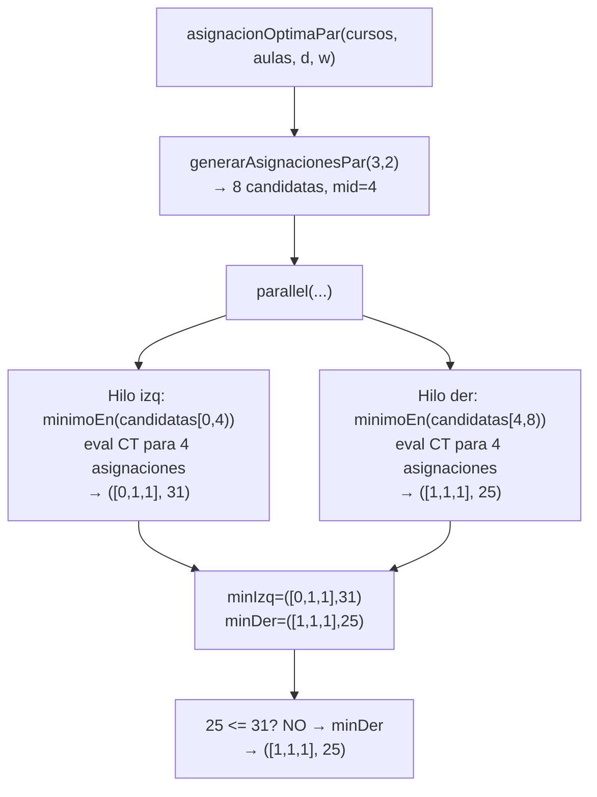

---

## Resumen del enfoque funcional

Todas las funciones — tanto secuenciales como paralelas — siguen los principios de programación funcional pura:

| Principio | Aplicación en el proyecto |
|---|---|
| Sin variables mutables | Todos los valores intermedios son `val` o parámetros de función |
| Sin ciclos imperativos | Se usan `map`, `flatMap`, `filter`, `sortBy`, `zip`, `count`, `sum` |
| Recursión pura | `generarAsignaciones`, `gen` (en Par), `merge` (con acumulador) |
| Funciones de alto orden | Presentes en todas las funciones de cálculo y generación |
| Paralelismo funcional | `parallel` y `task` del paquete `common` sin estado compartido |
